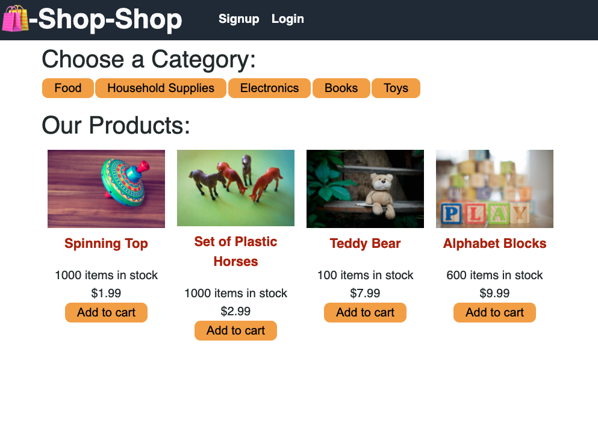

# Shop Shop
Ecommerce application built with MERN stack and utilizing global state. (A work still in progress)

Deployment: https://josh2100.github.io/shop-shop 

## Table of Contents

- [Installation](#installation)
- [Usage](#usage)
- [License](#license)
- [Contributions](#contributions)
- [Technologies](#technologies)
- [Credits](#credits)
- [Questions](#questions)

## Installation

Use "npm install" to install required modules for this application. Run "npm run start" to run React application. 

## Usage

Click a category to filter your product results. 

## License

This project is licensed under the MIT license.

## Contributions

Fork the project and create a pull request. Let me know how you think you can contribute!

## Technologies

Created with JavaScript, MongoDB, Mongoose, Express.js, React.js, Apollo, GraphQL, and Node.js.

## Credits

Created by Joshua Schermann

## Questions

Post an issue if you see a bug or suggested improvement.